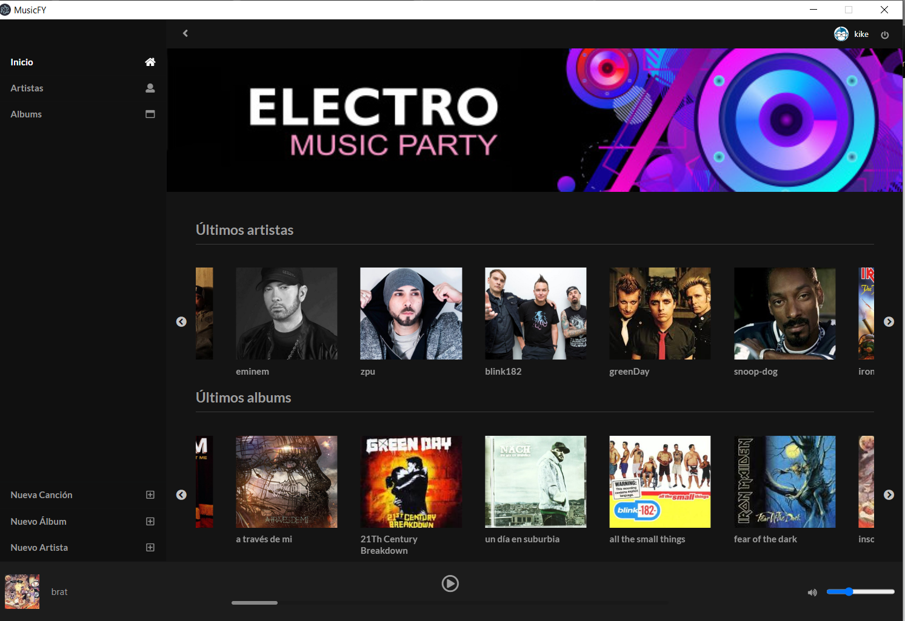

## `MUSICFY ELECTRON JS`

Proyecto hecho en ReactJS donde crearemos una aplicación de escritorio de música con el framework ElectronJS donde podremos añadir artistas, álbumes y canciones conectandolo a Firebase, todas ellas relacionadas entre si con sus correspondientes carátulas y donde podremos reproducir todas las canciones que queramos

### `FRAMEWORKS Y DEPENDENCIAS`

para el desarrollo de la aplicación hemos usado la libreria de ReactJS, dandole estilos con el preprocesador SASS y usando dependencias para facilitar la creación del proyecto .

- **Semantic-ui-react** para la interfaz de usuario
- **Firebase** base de datos donde guardaremos los datos
- **React-player** para reproducir la música
- **React-router-dom** para las rutas entre páginas
- **otros** todo lo demás... packageJSON ;)
